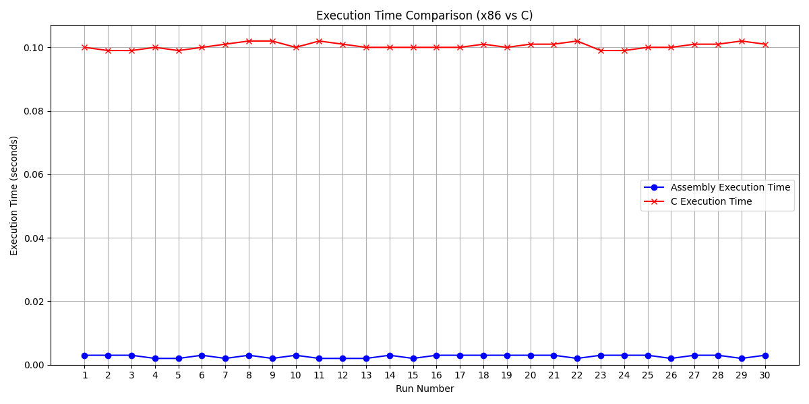
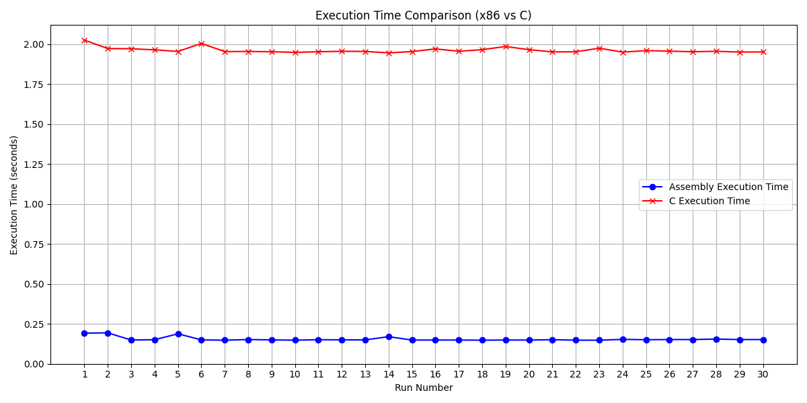

# **Specifications**

Implement a program that **converts the grayscale image representation** from **float-based** to **integer-based** using **C and x86 assembly language**. 

### **Function Overview**
**Function Name:** `imgCvtGrayDoubleToInt()`  
**Input:**  
- `height`  
- `width`  
- `double float pixel values`  

**Process:**  
The conversion formula is **I = 255 × f**, where `f` is the float pixel value.  

---

## **Code**

### **C Kernel**
The **C kernel** is written as a function within the same file as `main.c`. It performs the following operations:  
1. Multiplies the given **double float value** by `255.0`.  
2. Rounds the result using **round to nearest-ties to even**.  
3. Converts the result to `uint8` by typecasting.


> **Figure 01:** C Kernel  

---

### **Assembly Kernel**
The **Assembly kernel** is implemented in a separate `.asm` file named `asmfuncImgCvtGrayDoubleToInt.asm`. The steps are as follows:  

1. **Function Declaration:**  
   ```c
   extern uint8_t asmImgCvtGrayDoubleToInt(double num);
   ```  
2. **Function Call:**  
   ```c
   resultArrayASM[i][j] = asmImgCvtGrayDoubleToInt(array[i][j]);
   ```  
3. The assembly file uses **SIMD registers** for computation:  
   - Stores the parameter into `xmm0`.  
   - Loads `255.0` into `xmm1`.  
   - Multiplies `xmm0` and `xmm1` using **`mulsd`**, with the result stored in `xmm0`.  
   - Converts the double float to a scalar double word integer using **`RAX`**, rounded to nearest-ties to even.


> **Figure 02:** Assembly Kernel  


## **Program Execution**

1. **Input Format:**  
   - **First Line:** Height and width (e.g., `3 4`).  
   - **Subsequent Lines:** Double float pixel values in **row-major order**.

2. **Dynamic Memory Allocation:**  
   - Uses **`malloc`** for handling larger arrays.  
   - Deallocates memory at the end of the program.  

3. **Random Value Generation:**  
   - Functions under `<stdlib.h>` and `<time.h>` generate random values between `0` and `1`.  

---

## **Correctness Check**

Initially, the outputs from the **C** and **x86 programs** were verified against the expected values stated in the project specification.  
### **Example Input and Output**  
**Input:**  
- Height, Width: `3 4`  
- Pixel Values:  
  ```
  0.25 0.35 0.45 0.33
  0.55 0.65 0.75 0.33
  0.85 0.95 0.15 0.33
  ```

**Output:**  
```
64, 89, 115, 84
140, 166, 191, 84
217, 242, 38, 84
```


## 
Additionally, input validation was implemented for the random values required to compute execution times. This validation ensures result consistency between the C and x86 functions.
###


> **Figure 03:** Correctness Check  


## **Analysis of Data**

The performance was evaluated across various image dimensions, including the required `[10, 10]`, `[100, 100]`, and `[1000, 1000]`. It was extended to include `[10000, 10000]` for additional analysis. Each version (**debug** and **release**) was executed **30 times** to calculate the **average execution time**.  

### **Debug Version**
- **Figure 04:** Debug Version `10×10` Execution Times Across 30 Iterations Line Chart
 
     -  The x86 function's execution times are consistently low and close to zero across all iterations, making it stable and efficient given this image dimension. However, C has a low run time but with a spike in one iteration, increasing its average excution time, which could be caused by an overhead. 
- **Figure 06:** Debug Version `100×100` Execution Times Across 30 Iterations Line Chart
 
     -  The x86 function's execution times remain negligible and consistent across all iterations. C execution times are slightly higher than x86's but still stable and predictable. Given this image dimension, both implementations handle the workload well, yet x86 shown more promising result and retains a performance advantage with lower runtime.
- **Figure 07:** Debug Version `1000×1000` Execution Times Across 30 Iterations Line Chart
   
     -  C's run times are noticably higher and show slight fluctuations across iterations. As the workload increases, C's inefficiencies become more apparent.
- **Figure 08:** Debug Version `10000×10000` Execution Times Across 30 Iterations Line Chart
  
     -  For very large image dimensions, x86 clearly outperforms C in terms of execution time. The efficiency of x86 in handling low-level operations becomes evident here, while C struggles with higher overhead.

### **Release Version**
- **Figure 09:** Release Version `10×10` Execution Times Across 30 Iterations Line Chart
  
     - x86 and C show nearly identical performance with negligible differences. 
- **Figure 10:** Release Version `100×100` Execution Times Across 30 Iterations Line Chart
  
     -  x86 begins to outperform C with more consistent and lower execution times, while C shows sharp spikes, indicating higher variability.
- **Figure 11:** Release Version `1000×1000` Execution Times Across 30 Iterations Line Chart
   
  -  The difference becomes significant regarding x86 being consistently faster by approximately 9×, averaging ≈0.002 seconds compared to C's ≈0.018 seconds.
- **Figure 12:** Release Version `10000×10000` Execution Times Across 30 Iterations Line Chart
   
  -  x86 outperforms C with execution times averaging around 0.2 seconds, compared to the C program's consistent 2.0 seconds. This shows that x86 is approximately 10× faster than C given this image dimension.
---

## **Average Execution Time**
### **Debug Version**
  

### **Release Version**
  
